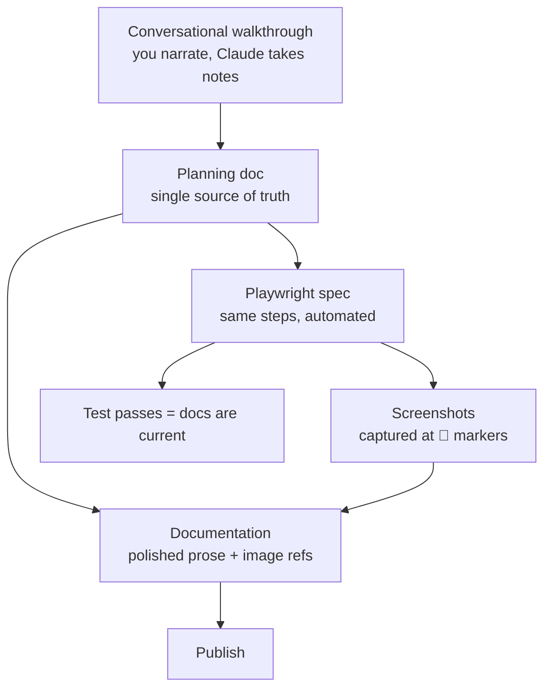

How to automatically generate documentation from a single source of truth that is written once and published everywhere.

---

Even after thirty years of building applications, I still find writing documentation a chore. It's not something I enjoy, and it's not something I look forward to. So I put it off until I have to.

## The job isn't done until the documentation is done

But of course it never is, and there are plenty of reasons why:

- Everything keeps changing while you build, so you can't write the docs until the project's complete
- By then the budget's gone, the deadline's gone, and nobody wants to take responsibility for it
- Even when it does get written, it goes stale the moment the project moves on

## All in on AI

I took two weeks annual holiday at the end of 2025 and had promised myself to get up to speed with AI. When I came back to work in January I went all in.

January 2026 was when I started my first fully vibe-coded projects. I committed to it completely. Not writing a line of code myself. Trusting Claude to write all of it.

[UpDoc](https://github.com/UmTemplates/UpDoc) was one of those projects. An Umbraco extension that creates documents from external sources like PDFs and web pages, built on Umbraco's new backoffice using Vite, Lit and TypeScript.

By the time I started I'd done the Claude tutorials, watched the YouTube videos, and got my head around how to actually work this way. Planning docs as the point of reference. Break the work into testable sprints. Let the AI do the writing, but keep the design in human hands.

Then UpDoc got complex. Fast. Halfway in I realised the obvious. There was no way I was going to write the documentation *after* building this thing. By the time it was finished I wouldn't remember why half of it worked the way it did.

## Everything everywhere all at once

I was already writing planning docs. Long, structured ones, with checklists, that Claude would work from to do the actual coding. They got archived once the sprint was done.

I was also already running end-to-end tests, using the Umbraco Claude skill for Playwright testing to drive the Umbraco backoffice.

Everything I was writing was markdown. Planning docs in Obsidian, code comments, README files, chat context. Claude reads it, writes it, transforms it. And every docs tool, every editor, every publishing platform I might use speaks markdown too. It was the common currency.

And then it hit me. Those planning docs already describe everything. The features, the decisions, the steps. Why am I writing them once for the build and then writing it all again for the documentation? And if Playwright is already walking the user flow, why can't it capture screenshots at the same time?

So I went back to Claude and asked: *can we document everything everywhere all at once?* One source. The planning doc becomes the docs page becomes the test becomes the screenshots. Write it once, publish it everywhere.

That's the loop this article is about. So what would I build it with?

### Written and hosted on GitBook

My first attempt was to automate documentation to GitBook:

- I'd already been using it for UmBootstrap
- Umbraco themselves use it for the official documentation
- No hosting setup, it's all managed by GitBook

I wrote planning docs, Claude turned them into markdown pages, and GitBook's Git sync pulled them in automatically.

However, I soon realised that I couldn't make the docs public without paying for a Premium plan.

So I decided to look for an alternative to GitBook.

### Written in MkDocs, hosted on GitHub Pages

I had previously used GitHub Pages for documentation but didn't find it great. I wondered if it had improved since I last used it, or if there was a way to improve it.

So I asked Claude how I could reuse the same markdown files I already had for GitBook, this time on GitHub Pages, and whether there were better alternatives to make the setup nicer. Claude came back with a step-by-step setup guide for MkDocs with the Material theme. Free, clean, and built to play nicely with GitHub Pages.

It worked really well. I moved the markdown files across, set up the Material theme, deployed to GitHub Pages with a GitHub Action, and had a proper-looking documentation site for free. The navigation was collapsible and expandable, the search worked, and the whole thing felt on par with GitBook. I was genuinely happy with it.

Once the MkDocs setup was working, I wanted to check it would be a safe long-term choice for other projects too. I did some digging. A few things made me pause:

- MkDocs is Python, but everything else in my projects is TypeScript or Node. It was the one folder that needed a Python toolchain
- The Material theme team had started work on a [successor called Zensical](https://squidfunk.github.io/mkdocs-material/blog/2025/11/05/zensical/), a ground-up rewrite
- MkDocs 2.0 was announced as a breaking rewrite of its own
- A [GitHub discussion about the project's maintenance](https://github.com/mkdocs/mkdocs/discussions/4089) turned into a public dispute

None of these were immediate problems, but they left me with a few doubts. So I did a shout-out to the frontend community on Bluesky, kindly amplified by [Andy Bell](https://bsky.app/profile/bell.bz). The recommendations came in:

- **Astro Starlight** — [Tia Nguyen](https://bsky.app/profile/tia-nguyen.bsky.social) (*"Quickly got it up and running"*), [Alberto Calvo](https://bsky.app/profile/intemperie.me) (*"Really solid stuff out of the box"*), [Sarah Rainsberger](https://bsky.app/profile/sarah11918.rainsberger.ca)
- **Hugo + docsy + Netlify** — [Abhishek Rathore](https://bsky.app/profile/abhirathore.bsky.social) (*"Not the easiest, but Hugo developer experience is great"*)
- **Fumadocs + Vercel** — [Moth](https://bsky.app/profile/timothy.is)
- **VitePress + GitHub Pages** — [Stefan Zweifel](https://bsky.app/profile/stefanzweifel.dev) (*"Super easy for me"*)
- **Self-hosting on a subdomain, or using the GitHub wiki** — [Owain Williams](https://bsky.app/profile/owain.codes)

### Written in Astro Starlight, hosted on Cloudflare Pages

I picked [Astro Starlight](https://starlight.astro.build).

The reason was simple. Starlight is Node. Node was already installed on every machine I owned because the Umbraco backoffice is TypeScript. One toolchain. No Python. Admonition syntax that matches every other modern docs tool I'd used.

Sixty-eight markdown files migrated in one weekend.

Where your docs live and where your docs get published turn out to be two different decisions. UpDoc's developer docs go to GitHub Pages because that's the zero-friction option for a public open-source project. But I've since written a second set of documentation for a client project, where the end-user manual needs to be login-only for their editors. That one goes to Cloudflare Pages, because Cloudflare Access lets me put permissions in front of the docs for free.

Same markdown. Same writing workflow. Different host, because different audience.

## The loop

Here's how I write UpDoc's documentation now.

### Step 1 — Conversational walkthrough with Claude

I open the test site. I open Claude in my editor. I narrate what I'm doing, step by step, in natural language.

*"I click Settings. UpDoc is in the Synchronisation group. I click it. I see a dashboard with three tabs..."*

Claude takes notes. Claude asks clarifying questions when I skip over something. When I describe a moment where a screenshot would help, Claude marks it with a 📸 emoji.

### Step 2 — Planning doc

Claude turns the walkthrough into a planning document. A file in `planning/` with numbered steps and 📸 markers.

I call this folder `planning/` but the name is a fossil. These documents start as plans. They stop being plans once the feature is built. What they become is a living design record — the single source of truth for everything downstream.

I review the planning doc. I correct mistakes. I approve it.

### Step 3 — Two artefacts from one source

From the approved planning doc, Claude generates two things in parallel:

- The **user-facing documentation** in `docs/src/content/docs/` — polished prose, image references, Starlight frontmatter
- The **Playwright spec** in `tests/e2e/` — TypeScript that walks through the same flow and captures a screenshot at every 📸 marker

Both are generated from the same source. They can't get out of sync at the start, because they were born together.

### Step 4 — Run the tests, get the screenshots

I run the Playwright spec against the running test site. It walks through the flow like a user would. At each 📸 marker it captures a screenshot and drops it into `docs/src/assets/screenshots/`.

The documentation file already has image references pointing at those exact paths. So the moment the screenshots land, the docs page is complete.

### Step 5 — Iterate

Selectors fail on the first run. They always do. I fix one at a time. Each fix takes about thirty seconds. The whole iteration loop is tighter than I'd have guessed before I tried it.

When the spec runs clean, I commit everything in one go. Screenshots, markdown, spec, planning doc. Push, merge, auto-deploy.

### The diagram

One conversation. One planning doc. Two artefacts. The test is the proof the docs are still true.

## Why this works

The loop does three jobs at once.

**The documentation describes the feature.** That's the obvious job.

**The Playwright spec proves the documentation is current.** If the UI changes and breaks a selector, the test fails. A failing test is a louder signal than stale docs, and it arrives before anyone reads the page. Docs that can't silently rot.

**The planning doc becomes the design record.** Six months later, when I've forgotten why a feature works the way it does, I can open the planning doc and read it back. It's the honest version — written *during* the build, not retrofitted afterwards.

One artefact per job would be three documents to maintain. The loop gives me three uses of one artefact.

Which brings me to my other writing principle, the one I should have led with:

> Why kill two birds with one stone when you can kill a flock with a rock?

## What it unlocked

Once the loop was working, other things started happening that I hadn't planned.

- I added [medium-zoom](https://github.com/francoischalifour/medium-zoom) so readers could click any screenshot to enlarge it. Fifteen minutes of work. It just slotted in.
- I added Mermaid diagram support so I could draw flows and architecture in the markdown itself. Another plugin, another afternoon, and the diagrams version with the prose that describes them.
- I added a [build-time guardrail](https://github.com/UmTemplates/UpDoc/pull/27) that fails the docs build if a local-machine path accidentally ends up in published content. Because the docs build is just another npm script, adding a check to it was the same shape as writing any other test.
- The docs began to feel like a first-class part of the project. Not a separate thing I was neglecting.

None of that would have happened in GitBook. Not because GitBook is bad. Because GitBook's interface treats your content as *data in their database*. You can't write a test against it. You can't add a build step to it. You can't grep it from your terminal.

Content in context. The context is the repo. Everything else follows.

## If you're an Umbraco developer thinking about docs

A few honest recommendations.

**If you want docs that look like docs.umbraco.com**, GitBook is still a good answer. The Git sync option means you can keep your repo as the source of truth. I haven't ruled GitBook out for future projects — it just didn't fit what I needed for this one.

**If you're on MkDocs today**, don't panic. Material is still actively maintained and beautiful. But the official successor is [Zensical](https://zensical.com). Plan a migration. Don't rush one.

**If you're starting fresh**, and especially if you're already writing TypeScript for the Umbraco backoffice, [Starlight](https://starlight.astro.build) will fit your brain. One runtime. One build. Muscle-memory syntax.

**Whatever you pick, get the docs into the repo.** That's the one decision that matters more than any of the tool choices.

## The shift

I still don't love writing documentation. I'm not sure I ever will.

But I no longer avoid it.

Because I don't really write documentation anymore. I have a conversation about a feature. That conversation becomes a planning doc. The planning doc becomes a docs page and a test in the same breath. The test runs. The screenshots land. The docs deploy.

Documentation stopped being a chore the moment it stopped being a separate thing.

It became a byproduct of work I was doing anyway.

Which, it turns out, is what I'd wanted all along.

---

## Sources and references

- [Umbraco Documentation](https://docs.umbraco.com) — runs on GitBook
- [Material for MkDocs — Zensical announcement](https://squidfunk.github.io/mkdocs-material/blog/2025/11/05/zensical/)
- [Material for MkDocs — What MkDocs 2.0 means for your projects](https://squidfunk.github.io/mkdocs-material/blog/2026/02/18/mkdocs-2.0/)
- [MkDocs governance discussion #4089](https://github.com/mkdocs/mkdocs/discussions/4089)
- [UpDoc on GitHub](https://github.com/UmTemplates/UpDoc)
- [UpDoc's MkDocs to Starlight migration guide](/UpDoc/migration-guide-mkdocs-to-starlight/)
- [Dean Leigh — Semantics in Web Development (24 Days in Umbraco, 2020)](https://archive.24days.in/umbraco-cms/2020/semantics-in-web-development/)
- [Skrift Magazine writer guidelines](https://skrift.io/write/)
