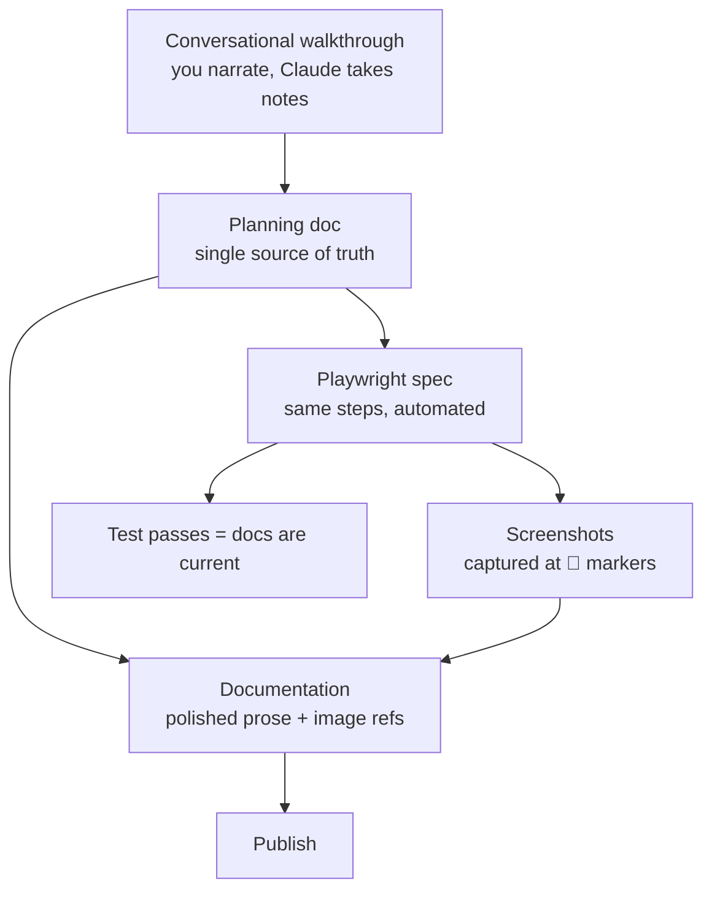

:::caution[Draft — not for publication]
This is a working draft of an article intended for [Skrift Magazine](https://skrift.io/). It is hosted here so it can be read on any device while it's being written. It is hidden from the sidebar and excluded from search indexing. Please do not share the URL publicly until the final version is published by Skrift.

Testing in Obsidian
:::

Writing documentation is the bit of the job I avoid. Always has been. I've been doing this for thirty years and I still put it off.

Then I started building [UpDoc](https://github.com/UmTemplates/UpDoc) — an Umbraco package that creates documents from external sources like PDFs and web pages. It got complex. Fast. Halfway in I realised the obvious. There was no way I was going to write the documentation *after* building this thing. By the time it was finished I wouldn't remember why half of it worked the way it did.

The only way out was to document it **as** I built it. Which meant asking a different question. Not *when* do I write the docs. *How do I make writing the docs part of the build?*

This article is the answer I've ended up with. How I learned to write docs as I code — and why one planning doc now does the work of three.

## The tool journey, briefly

I tried three documentation tools before I got to something I was happy with. Each one taught me something. None of them is the point of this article, so I'll keep it short.

### GitBook

Umbraco uses [GitBook](https://docs.umbraco.com). That was my reason for picking it — my readers are Umbraco developers, they're used to the GitBook interface, familiarity matters.

I signed up. Three times over the years, across three different organisations. Each time I set up a space. Each time I wrote maybe one page and drifted away.

The reason I kept drifting away — which I only worked out in hindsight — is that my docs kept wanting to live in my repo. Not in a hosted editor. In the same folder as the code they described.

I also hit a paid feature at some point. I genuinely can't remember which one. Custom domain, private access, something. It doesn't matter. By the time I hit it, the real issue was already obvious.

GitBook wasn't the wrong tool. It was the wrong **location**.

### MkDocs with Material

Next attempt: [MkDocs](https://www.mkdocs.org) with the [Material for MkDocs](https://squidfunk.github.io/mkdocs-material/) theme.

This one put the docs in the repo. Which was the main thing I needed.

It's also gorgeous. Material is a beautiful theme. Thousands of projects use it. It was the obvious choice.

Two things went wrong.

First, the toolchain. MkDocs is Python. The Umbraco backoffice is TypeScript. My build scripts are Node. The one folder in my whole project that needed Python was `docs/`. A small tax, every day.

Second, the ecosystem started fracturing in public. Within weeks of my setup:

- The [Material for MkDocs team launched Zensical](https://squidfunk.github.io/mkdocs-material/blog/2025/11/05/zensical/), a Rust-core successor
- MkDocs 2.0 was announced as a breaking rewrite
- A [GitHub discussion about reviving MkDocs maintenance](https://github.com/mkdocs/mkdocs/discussions/4089) turned into a public dispute about PyPI ownership
- The official advice from contributors became "move to Zensical"

I had a choice. Migrate to Zensical — same Python pipeline, same admonition syntax — or go somewhere genuinely different.

### Astro Starlight

I picked [Astro Starlight](https://starlight.astro.build).

The reason was simple. Starlight is Node. Node was already installed on every machine I owned because the Umbraco backoffice is TypeScript. One toolchain. No Python. Admonition syntax that matches every other modern docs tool I'd used.

Sixty-eight markdown files migrated in one weekend. I wrote a [migration guide](/UpDoc/migration-guide-mkdocs-to-starlight/) covering the whole process so anyone else could follow.

That's where I am today. Starlight in a `docs/` folder, deployed to GitHub Pages by a GitHub Action, same repo as the code.

## But the tools aren't the interesting bit

The interesting bit is what I started doing *because* the docs were finally in the right place.

I've been a frontend developer for decades. One of my own principles, from an article I wrote for [24 Days in Umbraco back in 2020](https://archive.24days.in/umbraco-cms/2020/semantics-in-web-development/):

> Content is king, context is queen — and together they rule.

That principle applies to HTML semantics. It applies to SEO. It applies to accessibility. And it turns out it applies to documentation too.

Putting docs in the repo gives them **context**. They sit next to the code they describe. They deploy from the same pipeline. They version with the commits that change them.

Once they're in the right context, all sorts of things become possible that weren't before.

## The loop

Here's how I write UpDoc's documentation now.

### Step 1 — Conversational walkthrough with Claude

I open the test site. I open Claude in my editor. I narrate what I'm doing, step by step, in natural language.

*"I click Settings. UpDoc is in the Synchronisation group. I click it. I see a dashboard with three tabs..."*

Claude takes notes. Claude asks clarifying questions when I skip over something. When I describe a moment where a screenshot would help, Claude marks it with a 📸 emoji.

### Step 2 — Planning doc

Claude turns the walkthrough into a planning document. A file in `planning/` with numbered steps and 📸 markers.

I call this folder `planning/` but the name is a fossil. These documents start as plans. They stop being plans once the feature is built. What they become is a living design record — the single source of truth for everything downstream.

I review the planning doc. I correct mistakes. I approve it.

### Step 3 — Two artefacts from one source

From the approved planning doc, Claude generates two things in parallel:

- The **user-facing documentation** in `docs/src/content/docs/` — polished prose, image references, Starlight frontmatter
- The **Playwright spec** in `tests/e2e/` — TypeScript that walks through the same flow and captures a screenshot at every 📸 marker

Both are generated from the same source. They can't get out of sync at the start, because they were born together.

### Step 4 — Run the tests, get the screenshots

I run the Playwright spec against the running test site. It walks through the flow like a user would. At each 📸 marker it captures a screenshot and drops it into `docs/src/assets/screenshots/`.

The documentation file already has image references pointing at those exact paths. So the moment the screenshots land, the docs page is complete.

### Step 5 — Iterate

Selectors fail on the first run. They always do. I fix one at a time. Each fix takes about thirty seconds. The whole iteration loop is tighter than I'd have guessed before I tried it.

When the spec runs clean, I commit everything in one go. Screenshots, markdown, spec, planning doc. Push, merge, auto-deploy.

### The diagram

One conversation. One planning doc. Two artefacts. The test is the proof the docs are still true.

## Why this works

The loop does three jobs at once.

**The documentation describes the feature.** That's the obvious job.

**The Playwright spec proves the documentation is current.** If the UI changes and breaks a selector, the test fails. A failing test is a louder signal than stale docs, and it arrives before anyone reads the page. Docs that can't silently rot.

**The planning doc becomes the design record.** Six months later, when I've forgotten why a feature works the way it does, I can open the planning doc and read it back. It's the honest version — written *during* the build, not retrofitted afterwards.

One artefact per job would be three documents to maintain. The loop gives me three uses of one artefact.

Which brings me to my other writing principle, the one I should have led with:

> Why kill two birds with one stone when you can kill a flock with a rock?

## What it unlocked

Once the loop was working, other things started happening that I hadn't planned.

- I added [medium-zoom](https://github.com/francoischalifour/medium-zoom) so readers could click any screenshot to enlarge it. Fifteen minutes of work. It just slotted in.
- I added a [build-time guardrail](https://github.com/UmTemplates/UpDoc/pull/27) that fails the docs build if a local-machine path accidentally ends up in published content. Because the docs build is just another npm script, adding a check to it was the same shape as writing any other test.
- The docs began to feel like a first-class part of the project. Not a separate thing I was neglecting.

None of that would have happened in GitBook. Not because GitBook is bad. Because GitBook's interface treats your content as *data in their database*. You can't write a test against it. You can't add a build step to it. You can't grep it from your terminal.

Content in context. The context is the repo. Everything else follows.

## Where the docs get published is a separate question

A thing I didn't properly understand until I lived it: **where your docs live** and **where your docs get published** are two different decisions.

UpDoc's developer docs go to [GitHub Pages](https://umtemplates.github.io/UpDoc/). Zero friction for a public open-source project.

For a client I'm working with now, the end-user manual will go to [Cloudflare Pages](https://pages.cloudflare.com/). Same markdown. Same repo. Same writing workflow. Different deploy target because that's where the rest of their infrastructure lives.

The writing tool and the publishing platform can be separated. Once you realise that, the publishing question shrinks to "which CDN, and do I want a custom domain?" — which is a much smaller question than "which docs platform do I commit the next five years to?"

## If you're an Umbraco developer thinking about docs

A few honest recommendations.

**If you want docs that look like docs.umbraco.com**, GitBook is still a good answer. The Git sync option means you can keep your repo as the source of truth. I haven't ruled GitBook out for future projects — it just didn't fit what I needed for this one.

**If you're on MkDocs today**, don't panic. Material is still actively maintained and beautiful. But the official successor is [Zensical](https://zensical.com). Plan a migration. Don't rush one.

**If you're starting fresh**, and especially if you're already writing TypeScript for the Umbraco backoffice, [Starlight](https://starlight.astro.build) will fit your brain. One runtime. One build. Muscle-memory syntax.

**Whatever you pick, get the docs into the repo.** That's the one decision that matters more than any of the tool choices.

## The shift

I still don't love writing documentation. I'm not sure I ever will.

But I no longer avoid it.

Because I don't really write documentation anymore. I have a conversation about a feature. That conversation becomes a planning doc. The planning doc becomes a docs page and a test in the same breath. The test runs. The screenshots land. The docs deploy.

Documentation stopped being a chore the moment it stopped being a separate thing.

It became a byproduct of work I was doing anyway.

Which, it turns out, is what I'd wanted all along.

---

## Sources and references

- [Umbraco Documentation](https://docs.umbraco.com) — runs on GitBook
- [Material for MkDocs — Zensical announcement](https://squidfunk.github.io/mkdocs-material/blog/2025/11/05/zensical/)
- [Material for MkDocs — What MkDocs 2.0 means for your projects](https://squidfunk.github.io/mkdocs-material/blog/2026/02/18/mkdocs-2.0/)
- [MkDocs governance discussion #4089](https://github.com/mkdocs/mkdocs/discussions/4089)
- [UpDoc on GitHub](https://github.com/UmTemplates/UpDoc)
- [UpDoc's MkDocs to Starlight migration guide](/UpDoc/migration-guide-mkdocs-to-starlight/)
- [Dean Leigh — Semantics in Web Development (24 Days in Umbraco, 2020)](https://archive.24days.in/umbraco-cms/2020/semantics-in-web-development/)
- [Skrift Magazine writer guidelines](https://skrift.io/write/)
