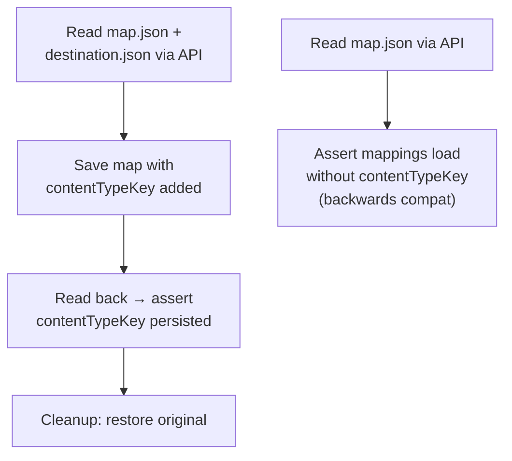
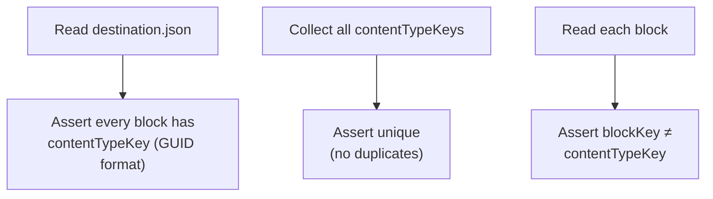
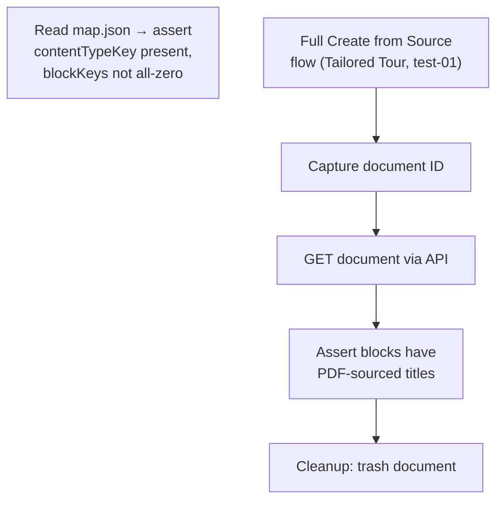
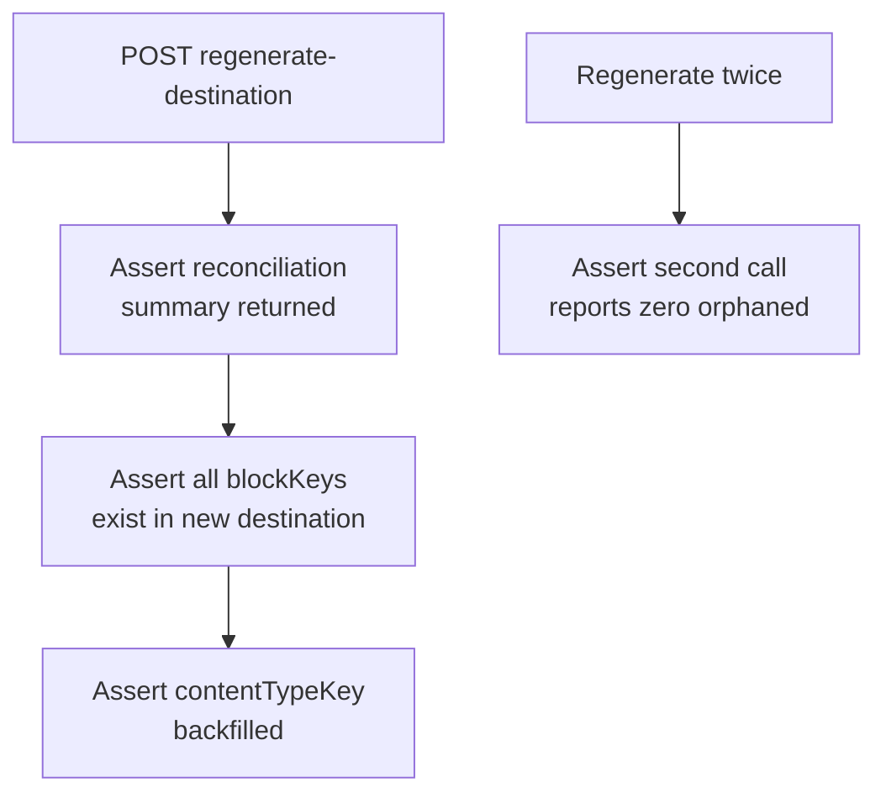
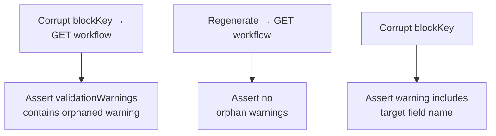
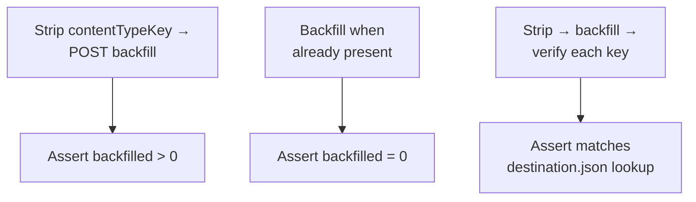
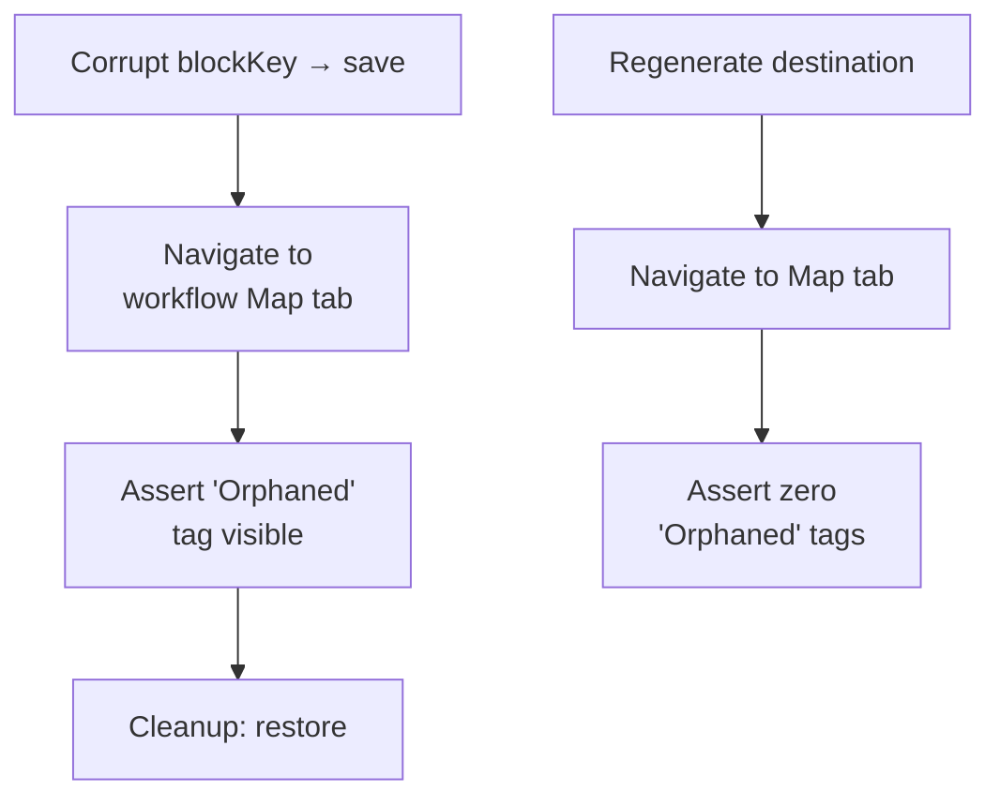
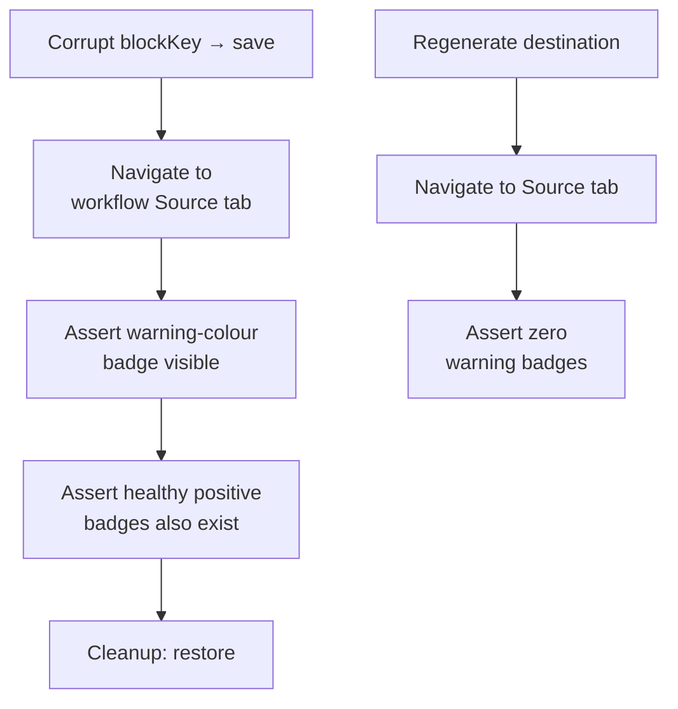

**Spec file:** `blockkey-reconciliation.spec.ts`
**Tests:** 14 (across 8 sprint groups)
**Section:** API + Settings → UpDoc → Tailored Tour Pdf workflow

These tests cover the BlockKey reconciliation feature — ensuring that block mappings in `map.json` survive blueprint regeneration and that orphaned mappings are detected and surfaced in the UI. Tests are organised by the sprint in which they were implemented.

---

## Sprint 1: contentTypeKey Model Support

**2 tests** — Verifies that `contentTypeKey` can be stored in and retrieved from `map.json`.

### Round-Trip Test

1. Read current `map.json` and `destination.json` via API
2. Find a mapping with a `blockKey`, add `contentTypeKey` from destination
3. Save via `PUT /workflows/{name}/map`
4. Read back and assert `contentTypeKey` persisted
5. Cleanup: restore original `map.json`

### Backwards Compatibility

- Read existing `map.json` (pre-contentTypeKey era)
- Assert mappings load correctly even when `contentTypeKey` is absent

---

## Sprint 2: Destination Blocks Have contentTypeKey

**3 tests** — Verifies that `destination.json` provides `contentTypeKey` on every block.

| Test | Asserts |
|------|---------|
| Non-empty contentTypeKey | Every block in `blockGrids` and `blockLists` has a GUID-format `contentTypeKey` |
| Unique contentTypeKeys | No two blocks share the same `contentTypeKey` |
| blockKey ≠ contentTypeKey | Instance key and type key are different values |

---

## Sprint 3: Bridge Resilience

**2 tests** — Verifies that the Create from Source bridge code uses `contentTypeKey` to match blocks.

### Precondition Check

- Read `map.json` → assert all block mappings have `contentTypeKey` and reconciled (non-zero) `blockKey`

### Full Creation Flow

1. Navigate to Tailored Tours collection
2. Create from Source → select Tailored Tour blueprint → `updoc-test-01.pdf`
3. Wait for extraction, click Create, capture document ID from URL
4. `GET /document/{id}` via API
5. Assert block grid blocks have PDF-sourced titles (not blueprint defaults like "Features")
6. Assert Accommodation block is populated
7. Cleanup: move document to recycle bin

---

## Sprint 4: Auto-Reconcile on Regenerate

**2 tests** — Verifies that `POST /workflows/{name}/regenerate-destination` reconciles blockKeys.

### Reconciliation Test

1. Read current config
2. `POST regenerate-destination`
3. Assert response contains `reconciliation` object with `updated`, `orphaned`, `details`
4. Read `map.json` after reconciliation
5. Build set of valid blockKeys from new `destination.json`
6. Assert all blockKeys in `map.json` exist in new destination
7. Assert `contentTypeKey` is present on all block mappings (backfilled)

### Idempotent Test

- Call `regenerate-destination` twice
- Assert second call reports `orphaned = 0`

---

## Sprint 5: Validation Warnings

**3 tests** — Verifies that orphaned blockKeys produce validation warnings in the API response.

### Orphaned Warning

1. Read `map.json`, save original
2. Corrupt a blockKey to `deadbeef-dead-beef-dead-beefdeadbeef`
3. Save corrupted map
4. `GET /workflows/{name}` → assert `validationWarnings` array contains warning mentioning the bogus key and the word "orphaned"
5. Cleanup: restore original

### No Warnings When Healthy

- Regenerate destination, then GET workflow
- Assert no orphan warnings in `validationWarnings`

### Warning Includes Target Name

- Corrupt a blockKey, note the `target` field name
- GET workflow → assert warning includes both the bogus key and the target name
- Cleanup: restore

---

## Sprint 6: Backfill Migration

**3 tests** — Verifies the `POST /workflows/{name}/backfill-content-type-keys` endpoint.

### Backfill Adds Missing Keys

1. Regenerate destination (ensure blockKeys are valid)
2. Strip `contentTypeKey` from all block mappings in `map.json`
3. Save stripped map, verify keys are gone
4. `POST backfill-content-type-keys`
5. Assert `backfilled > 0`
6. Read map back — all block mappings have `contentTypeKey` in GUID format
7. Cleanup: restore original

### Already Present

- Regenerate + backfill when keys already exist
- Assert `backfilled = 0`

### Correct Matching

1. Build a `blockKey → contentTypeKey` lookup from `destination.json`
2. Strip contentTypeKey from map, backfill
3. Verify each backfilled `contentTypeKey` matches the destination lookup
4. Cleanup: restore

---

## Sprint 7: Orphaned Tag on Map Tab

**2 tests** — Verifies the UI surfaces orphaned mappings on the Map tab.

### Orphaned Tag Visible

1. Corrupt a blockKey → save `map.json`
2. Navigate to `settings/workspace/updoc-workflow/edit/tailoredTourPdf`
3. Click "Map" tab
4. Assert `uui-tag` with text "Orphaned" is visible
5. Cleanup: restore

### No Orphaned Tags When Healthy

1. Regenerate destination
2. Navigate to Map tab
3. Assert zero "Orphaned" tags

---

## Sprint 8: Orphaned Badges on Source Tab

**2 tests** — Verifies warning-colour badges on the Source tab for orphaned mappings.

### Warning Badge Visible

1. Corrupt a blockKey → save `map.json`
2. Navigate to workflow Source tab
3. Assert `uui-tag[color="warning"].mapped-tag` is visible
4. Assert `uui-tag[color="positive"].mapped-tag` also exists (healthy mappings)
5. Cleanup: restore

### No Warning Badges When Healthy

1. Regenerate destination
2. Navigate to Source tab
3. Assert zero `uui-tag[color="warning"]` badges

---

## Cleanup Pattern

Most tests in this spec follow the same cleanup pattern:

1. **Save original state** — `JSON.parse(JSON.stringify(config.map))` at the start
2. **Corrupt/modify** — change blockKeys or strip contentTypeKey
3. **Test** — assert expected behaviour
4. **Restore** — `PUT /workflows/{name}/map` with the original map in a `finally` block

Sprint 3's creation test uses `trashDocument()` to move the created document to the recycle bin, with `PROTECTED_IDS` safeguards.
