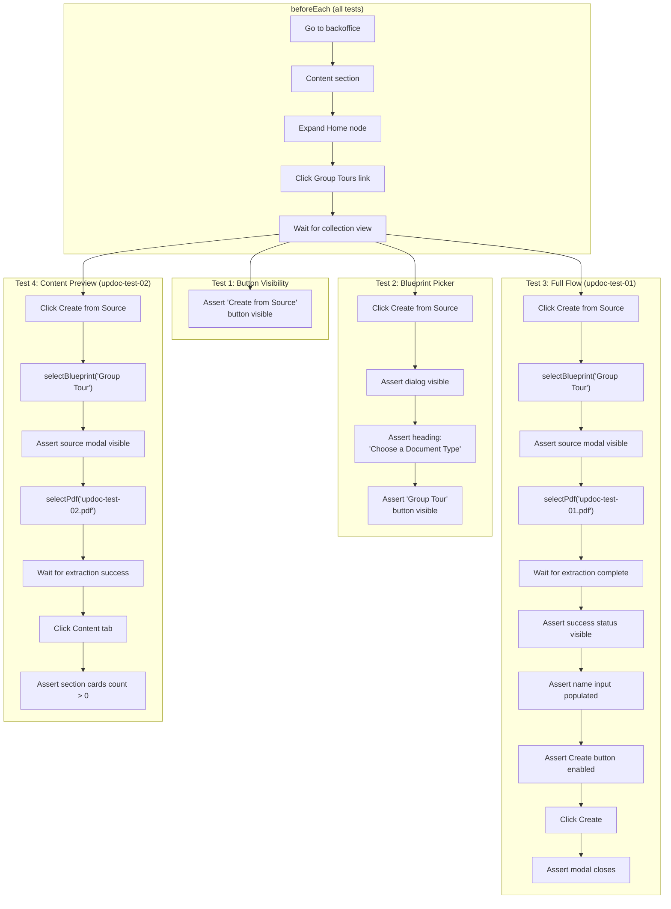

**Spec file:** `create-from-source.spec.ts`
**Tests:** 4
**Section:** Content → Group Tours collection

These tests verify the core Create from Source UI workflow — from clicking the button through to document creation.

## Test Flow

## Tests

### Test 1: Button Visibility

Asserts that the "Create from Source" button is visible in the Group Tours collection toolbar.

**Asserts:**
- `getByRole('button', { name: 'Create from Source' })` is visible

### Test 2: Blueprint Picker Opens

Clicks "Create from Source" and verifies the blueprint picker dialog appears.

**Steps:**
1. Click "Create from Source" button
2. Wait for dialog to appear

**Asserts:**
- Dialog is visible
- "Choose a Document Type" heading is visible
- "Group Tour" button is visible inside `blueprint-picker-modal`

### Test 3: Full Flow — Create Document from PDF

End-to-end test: clicks the button, selects a blueprint, picks a PDF, waits for extraction, and creates the document.

**Steps:**
1. Click Create from Source
2. Select "Group Tour" blueprint (via `selectBlueprint`)
3. Assert source modal (`up-doc-modal`) is visible
4. Select `updoc-test-01.pdf` (via `selectPdf`)
5. Wait for extraction to complete (`.extraction-status.extracting` disappears)
6. Assert `.extraction-status.success` is visible
7. Assert name input (`uui-input#name input`) is not empty
8. Assert Create button is enabled
9. Click Create
10. Assert modal closes

**Asserts:**
- Extraction succeeds
- Document name is auto-populated from PDF content
- Create button becomes enabled after extraction
- Modal closes after document creation

### Test 4: Content Tab Shows Mapped Preview

Verifies that the Content tab renders preview cards after extraction.

**Steps:**
1. Click Create from Source → select Group Tour blueprint
2. Select `updoc-test-02.pdf`
3. Wait for extraction success
4. Click the "Content" tab inside the source modal
5. Count `.section-card` elements

**Asserts:**
- Content tab is enabled after extraction
- At least one section card is rendered

## Cleanup

:::caution[No cleanup]
This spec file does **not** delete created documents after tests. Test documents accumulate in the Group Tours collection. The full flow test (Test 3) creates a document each run.
:::
