**Spec file:** `document-verification.spec.ts`
**Tests:** 3 (parameterised across 3 PDFs = 9 test runs)
**Section:** Content → Tailored Tours collection

These tests create a Tailored Tour document from each test PDF, then use the Umbraco Management API to verify that every mapped field has the correct value — no raw markdown, proper HTML in rich text fields, and block content populated from the PDF rather than blueprint defaults.

## Test Flow

```mermaid
flowchart TD
    subgraph beforeEach["beforeEach"]
        A[Go to backoffice] --> B[Content section]
        B --> C[Expand Home]
        C --> D[Click Tailored Tours]
        D --> E[Wait for collection]
    end

    subgraph test["Test: Verify mapped fields (×3 PDFs)"]
        E --> F["Click Create from Source"]
        F --> G["selectBlueprint('Tailored Tour')"]
        G --> H[selectPdf with test PDF]
        H --> I[Wait for extraction success]
        I --> J[Assert doc name populated, no # prefix]
        J --> K[Click Create, wait for URL change]
        K --> L[Capture document ID from URL]
        L --> M["GET /document/{id} via API"]

        M --> N["Assert document name:\nno markdown"]
        N --> O["Assert pageTitle:\npopulated, contains expected\nsubstring, no markdown"]
        O --> P["Assert pageTitleShort:\npopulated, no markdown"]
        P --> Q["Assert pageDescription:\npopulated, no markdown"]
        Q --> R["Assert organisers Block List:\n≥1 block, org populated,\nnot blueprint dummy"]
        R --> S["Assert block grid:\nblocks exist"]
        S --> T["Assert Features block:\ntitle exists, no markdown,\nrichText has HTML"]
        T --> U["Assert Accommodation block:\ntitle, richText"]
        U --> V["Assert Itinerary block:\nrichText has HTML,\nsummary no markdown"]
    end

    subgraph afterEach["afterEach (cleanup)"]
        V --> W{Protected ID?}
        W -->|Yes| X[Skip]
        W -->|No| Y{Is tailoredTour type?}
        Y -->|No| Z[Skip]
        Y -->|Yes| AA[Move to recycle bin]
    end
```

## Test Parameters

Each test runs with all three test PDFs:

| PDF | Label | Title Substring |
|-----|-------|-----------------|
| `updoc-test-01.pdf` | Dresden | "Dresden" |
| `updoc-test-02.pdf` | Suffolk | "Suffolk" |
| `updoc-test-03.pdf` | Andalucia | "Andaluc" |

## What Each Test Verifies

The test creates a document via the full Create from Source UI flow, captures the document ID from the resulting URL, then fetches the document via `GET /umbraco/management/api/v1/document/{id}` and asserts:

### Step 4: Document Name

- Document variant name exists
- No markdown heading prefix (`# `) or bold markers (`**`)

### Step 5: Top-Level Text Fields

| Field | Type | Assertions |
|-------|------|------------|
| `pageTitle` | text | Populated, contains expected substring (e.g., "Dresden"), no markdown |
| `pageTitleShort` | text | Populated, no markdown |
| `pageDescription` | textArea | Populated, no markdown |

### Step 6: Organiser Block List

- `organisers` Block List has at least one block
- `organiserOrganisation` is populated with PDF content
- Organiser fields are not blueprint dummy values ("Organisation Test", "Organiser Name Test")
- No markdown in any populated organiser field

### Step 7: Block Grid

- `blockGridTailoredTour` has blocks
- **Features block:** title exists, no markdown, rich text has HTML markup (not raw markdown)
- **Accommodation block:** title exists, no markdown, rich text has HTML
- **Suggested Itinerary block:** rich text has HTML, summary has no markdown

## Cleanup

Each test cleans up after itself in `afterEach`:

1. **Protected ID check** — never deletes Home, collection nodes, etc.
2. **Document type check** — fetches the document type alias via two API calls (`/document/{id}` → `/document-type/{typeId}`), only proceeds if it's `tailoredTour`
3. **Move to recycle bin** — `PUT /document/{id}/move-to-recycle-bin`

If any check fails, cleanup is skipped with a console error.
