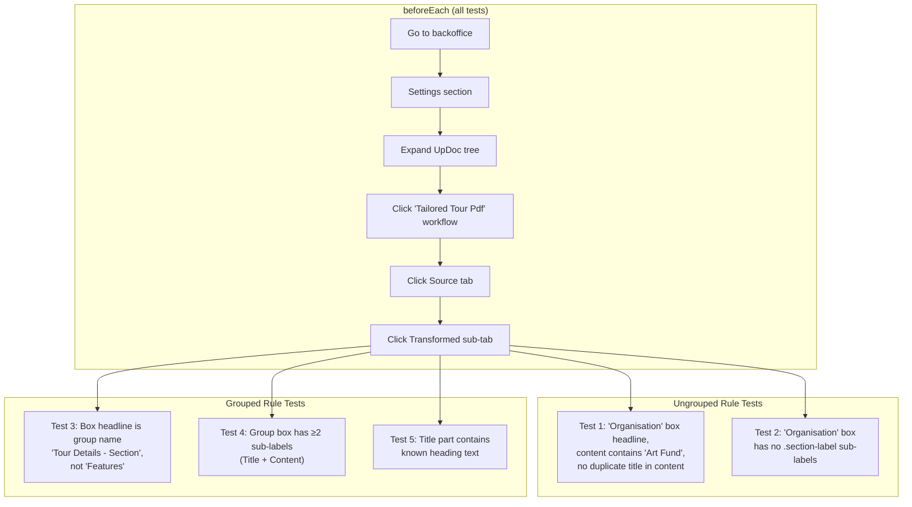

**Spec file:** `transformed-view.spec.ts`
**Tests:** 5
**Section:** Settings → UpDoc → Tailored Tour Pdf workflow → Source → Transformed

These tests verify how transform rules render on the Transformed tab of the workflow editor. Ungrouped rules should display differently from grouped rules — different box titles, different internal structure.

## Test Flow

## Tests

### Test 1: Ungrouped — Box Title Is Role Name

Finds the `uui-box[headline="Organisation"]` element and verifies:
- The headline attribute is "Organisation"
- Content area (`.md-section-content`) contains "Art Fund" (matched text)
- The title is not duplicated inside the content (no "Organisation Organisation" pattern)

### Test 2: Ungrouped — No Sub-Labels

Verifies that ungrouped rules don't have the `.section-label` elements that grouped rules use.

**Asserts:**
- `uui-box[headline="Organisation"]` contains zero `.section-label` elements

### Test 3: Grouped — Box Title Is Group Name

Verifies that grouped rules use the group name as the box title, not the individual section title.

**Asserts:**
- `uui-box[headline="Tour Details - Section"]` is visible
- No `uui-box[headline="Features"]` exists (that would be the old broken behaviour)

### Test 4: Grouped — Has Sub-Labels

Verifies that grouped rules have sub-labels for their parts (Title, Content, etc.).

**Asserts:**
- Group box has ≥2 `.section-label` elements
- First label contains "Title"
- A label with "Content" exists

### Test 5: Grouped — Title Part Has Heading Text

Verifies that the title part of a grouped rule contains the actual section heading from the PDF.

**Asserts:**
- First `.md-part-content` in the group box contains one of: "Features", "What We Will See", "Optional", "Accommodation", "Extras To Your Tour"

## Cleanup

No cleanup needed — these tests are read-only (they navigate to a workflow workspace and inspect the rendered output).
